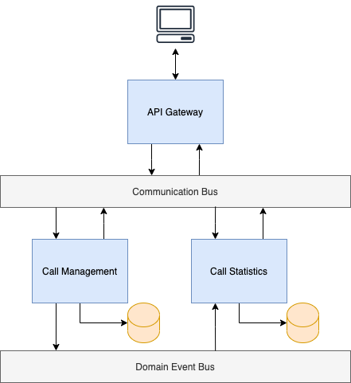

# Talkdesk Challenge Task

## Table of Contents
- [Requirements](#system-requirements)
- [Installation](#installation)
- [Exposed endpoints](#exposed-endpoints)
- [Architecture](#architecture)

## System Requirements
Minimum requirements for running the solution are:
- [docker](https://docs.docker.com/engine/install/) (tested on version 20.10.2)
- [docker-compose](https://docs.docker.com/compose/install/) (tested on version 1.27.4)

Optional requirements:
- [JDK (Java Development Kit) 11](https://openjdk.java.net/projects/jdk/11/)
  (There is also dockerized build option, in case there is no JDK 11 installed,
  see [below](#installation-with-dockerized-build))

## Installation

> 📝 All the command line commands are provided for unix/linux based systems.
> For windows, please make according adjustments.

### Default installation

> 📝 JDK 11 is required for default installation

1. Change to the project directory
```shell
cd <project-dir>
```
2. Build/Package the project
```shell
./mvnw clean package
```
3. Change to the according docker directory
```shell
cd docker/default/
```
4. Build and up the docker stack
```shell
docker-compose up -d
```

### Installation with dockerized build

1. Change to the according docker directory within the project directory
```shell
cd <project-dir>/docker/dockerized-build/
```
2. Build/Package the project within docker container
```shell
docker build -f ./Dockerfile.build -t talkdesk-challenge-builder ../..
```
3. Build and up the docker stack
```shell
docker-compose up -d
```

## Exposed endpoints

Swagger UI is provided for testing the API. It is available at the following URL:
> [http://localhost:9000/](http://localhost:9000/)

The API itself is exposed at the following URL:
> [http://localhost:9000/api/](http://localhost:9000/api/)

Additionally, MongoDB UI is provided at the following URL:
> [http://localhost:9000/db/](http://localhost:9000/db/)

## Architecture

The following is the overall architecture diagram of the system:



The solution is implemented as microservices.
In a microservices architecture the system is composed of multiple services, which are:
- Highly maintainable
- Loosely coupled
- Independently deployable
- Independently scalable
- Organized around business capabilities / subdomains

The system consists of the following services:
- **Call Management** - The main service, which is responsible for call management.
  Registers handlers for adding/removing, as well as querying calls.
- **Call Statistics** - Provides call statistics, which is collected based on the
  domain events fired by the Call Management service (call added/removed).
  Registers handler for querying call stats.
- **API Gateway** - Provides REST API endpoint, based on the OpenAPI specification,
  transforms incoming HTTP requests to the commands/queries and asynchronously sends
  to the appropriate service through the Communication Bus, then, upon receiving the reply,
  transforms it back to the HTTP response and send to the client.

### Asynchronous communication

The communication between services is fully asynchronous (through the Communication and Event Buses).
It ensures loose runtime coupling and improved availability.

- **Communication Bus** is used for sending commands/queries to the services.
  Used primarily by API Gateway to send commands/queries to functional services.
- **Domain Event Bus** is used for firing domain events by functional services,
  as well as subscribing/receiving events from other services.

### Database per service
Each individual service has its own database, which ensures loose coupling between services.
It also enables to use different types of databases, based on the specific needs.

### Event sourcing
The state of the system is represented as a sequence of domain events, stored in an event store
(as opposed to the last state), which is the source of truth.
Thus, the databases are just derivatives of the event store.
Each individual database can be rebuilt from scratch by replaying the events.
Also, there is ability to query the state at any point in time.

